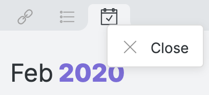
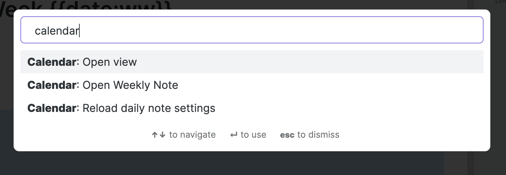
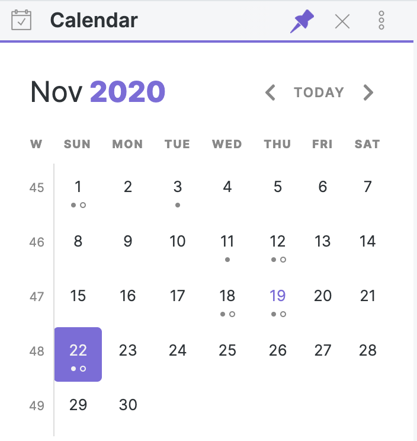

# obsidian-calendar-plugin

This plugin for [Obsidian](https://obsidian.md/) creates a simple Calendar view for visualizing and navigating between your daily notes.


## Usage

After enabling the plugin in the settings menu, you should see the calendar view appear in the right sidebar.

The plugin reads your Daily Note settings to know your date format, your daily note template location, and the location for new daily notes it creates.

## Features

- Go to any **daily note**.
- Create new daily notes for days that don't have one. (This is helpful for when you need to backfill old notes or if you're planning ahead for future notes! This will use your current **daily note** template!)
- Visualize your writing. Each day includes a meter to approximate how much you've written that day.
- Use **Weekly notes** for an added organization layer! They work just like daily notes, but have their own customization options.

## Settings

- **Start week on Monday [default: off]**: Update the Calendar view to show Monday as the first day of the week.
- **Words per Dot [default: 250]**: Starting in version 1.3, dots reflect the word count of your files. By default, each dot represents 250 words, you can change that value to whatever you want. **Note:** There is a max of 5 dots so that the view doesn't get too big!
- **Confirm before creating new note [default: on]**: If you don't like that a modal prompts you before creating a new daily note, you can turn it off.
- **Show Week Number [default: off]**: Enable this to add a new column to the calendar view showing the [Week Number](https://en.wikipedia.org/wiki/Week#Week_numbering). Clicking on these cells will open your **weekly note**.

## Customization

The following CSS Variables can be overridden in your `obsidian.css` file.

```css
/* obsidian-calendar-plugin */
/* https://github.com/liamcain/obsidian-calendar-plugin */

#calendar-container {
  --color-background-heading: transparent;
  --color-background-day: transparent;
  --color-background-weeknum: transparent;

  --color-dot: var(--text-muted);
  --color-arrow: var(--text-muted);
  --color-button: var(--text-muted);

  --color-text-title: var(--text-normal);
  --color-text-heading: var(--text-muted);
  --color-text-day: var(--text-normal);
  --color-text-today: var(--interactive-accent);
  --color-text-weeknum: var(--text-muted);
}
```

## Compatibility

`obsidian-calendar-plugin` currently requires Obsidian v0.9.11 or above to work properly.

## Installation

You can install the plugin via the Community Plugins tab within Obsidian. Just search for "Calendar."

## FAQ

### What do the dots mean?

Each solid dot represents 250 words in your daily note. So 4 dots means you've written a thousands words for that day! If you want to change that threshold, you can set a different value for "Words Per Dot" in the Calendar settings.

The hollow dots, on the other hand, mean that the day has incomplete tasks in it. **Note:** There will only ever be 1 hollow dot on a particular day, regardless of the number of remaining tasks\*\*

### How do I change the styling of the Calendar?

By default, the calendar should seamlessly match your theme, but if you'd like to further customize it, you can! In your `obsidian.css` file (inside your vault) you can configure the styling to your heart's content.

### Can I add week numbers to the calendar?

In the settings, you can enable "Show Week Numbers" to add a "week number" column to the calendar. Click on the week number to open a "weekly note".

### How do I hide the calendar plugin without disabling the plugin?

Just like other sidebar views (e.g. Backlinks, Outline), the calendar view can be closed by right-clicking on the view icon.



### I accidentally closed the calendar. How do I reopen it?

If you close the calendar widget (right-clicking on the panel nav and clicking close), you can always reopen the view from the Command Palette. Just search for `Calendar: Open view`.



### How do I have the calendar start on Monday?

From the Settings menu, you can toggle "Start week on Monday".

### I don't like showing the week numbers but I still want to use weekly notes. Can I still use them?

You can open the current weekly note from the command palette by searching `Calendar: Open weekly Note`. This will open the weekly note for the current week.

To configure the `format`, `folder`, and `template`, you will temporarily need to toggle on "Show weekly numbers" in the settings, but if you toggle it back off, your settings will persist.

## Protips

### Embed your entire week in a weekly note

If you add the following snippet to your weekly note template, you can a seamless view of your week in a single click.

```
## Week at a Glance

![[{{sunday:YYYY-MM-DD}}]]
![[{{monday:YYYY-MM-DD}}]]
![[{{tuesday:YYYY-MM-DD}}]]
![[{{wednesday:YYYY-MM-DD}}]]
![[{{thursday:YYYY-MM-DD}}]]
![[{{friday:YYYY-MM-DD}}]]
![[{{saturday:YYYY-MM-DD}}]]
```

### Hover Preview

Just like the Obsidian's graph and internal links, the calendar supports page previews for your daily notes. Just hover over a cell while holding down `Ctrl/Cmd` on your keyboard!

### The calendar can be moved (and pinned!) anywhere

Just because the calendar appears in the right sidebar doesn't mean it has to stay there. Feel free to drag it to the left sidebar, or (if you have the screen real estate for it) into the main content area. If you move it out of the sidebar, the view can even be pinned; great for more advanced tile layouts!



### Open daily notes in a new split

If you `Ctrl/Command`-Click on a note in your calendar, it will open daily note in a new split. Useful if you want to open a bunch of daily notes in a row (especially if you have the **Sliding Panes** plugin enabled!)

### Weekly Notes

You can open **weekly notes** in 2 ways: searching `Calendar: open weekly note` in the command palette or by clicking on the week number. Weekly notes can be configured from the Calendar settings. There are 3 settings:

- **Folder:** The folder that your weekly notes go into. It can be the same or different from your daily notes. By default they are placed in your vault root.
- **Template:** Configure a template for weekly notes. Weekly notes have slightly different template tags than daily notes. See here for the list of supported [weekly note template tags](#template-tags).

> Note: The path here won't autocomplete for you, you'll need to enter the full path.

- **Format:** The date format for the weekly note filename. Defaults to `"YYYY-[W]ww`. If you use `DD` in the week format, this will refer to first day of the week (Sunday or Monday, depending on your settings).

#### Template Tags

| Tag                                                                                    | Description                                                                                                                                                                                                  |
| -------------------------------------------------------------------------------------- | ------------------------------------------------------------------------------------------------------------------------------------------------------------------------------------------------------------ |
| `sunday`, `monday`, `tuesday`, `wednesday`, `thursday`, `friday`, `saturday`, `sunday` | Because weekly tags refer to main days, you can refer to individual days like this `{{sunday:YYYY-MM-DD}}` to automatically insert the date for that particular day. Note, you must specify the date format! |
| `title`                                                                                | Works the same as the daily note `{{title}}`. It will insert the title of the note                                                                                                                           |
| `date`, `time`                                                                         | Works the same as the daily note `{{date}}` and `{{time}}`. It will insert the date and time of the first day of the week. Useful for creating a heading (e.g. `# # {{date:YYYY [Week] ww}}`).               |
